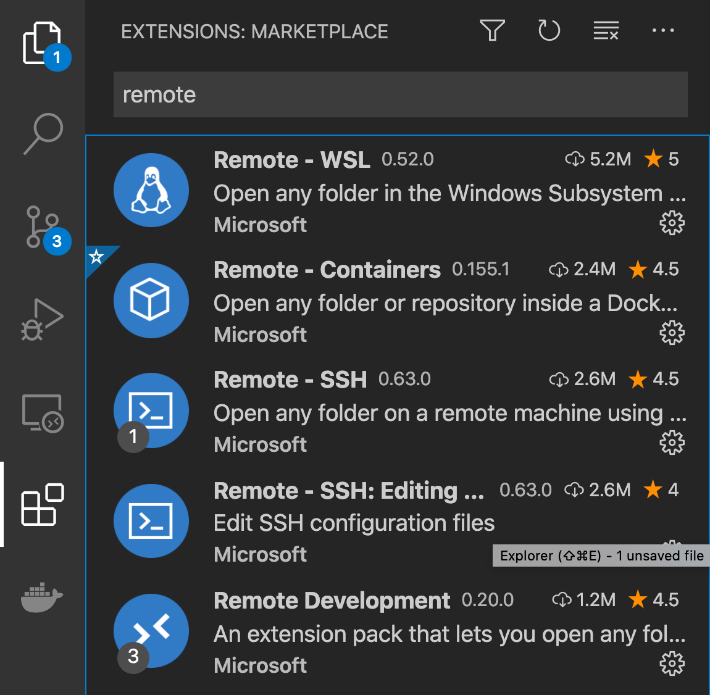
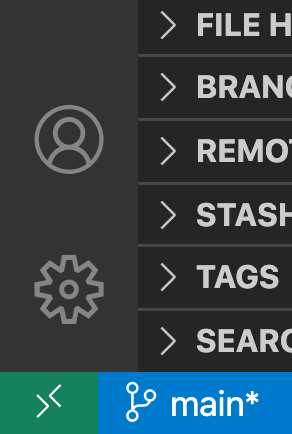
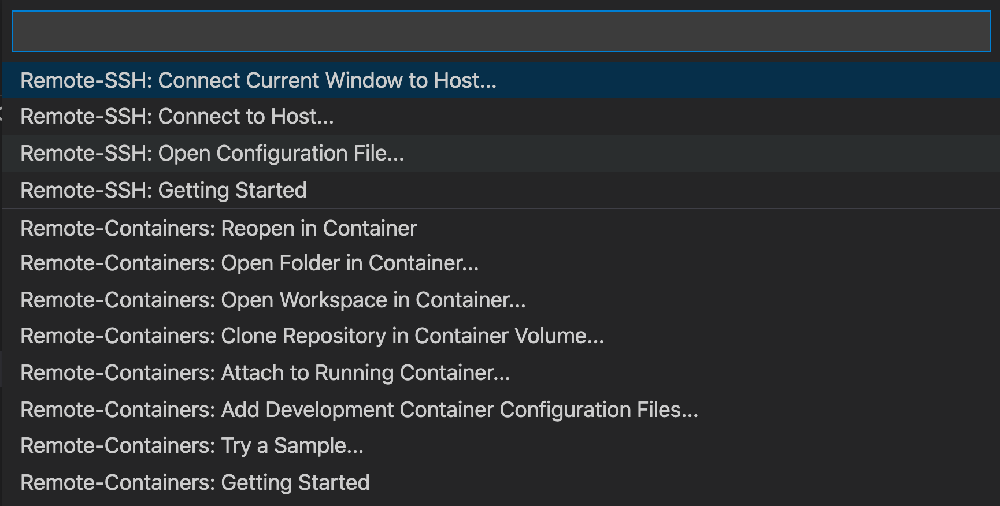

Debugging Python Applications with Docker and VSCode
==
# Introduction
This repo consists of tutorials on using Docker with VSCode to debug python applications.
It is recommended to follow the tutorials sequentially.

# VS Code configuration
VS Code supports a large number of extensions for adding additional functionality beyond the useful essentials.
This tutorial makes use of the the remote development extension pack that should be installed by clicking the extenions (4 squares) icon on the left hand Activity bar and searching for `Remote Development`.
This extension allows VS Code on a local machine to view and edit source code on a remote machine or container.
Additional language features are available with other extensions.



Once installed, a green icon will be available in the bottom left of VS Code, titled `Open a remote window`.
On click, a dropdown with a number of options will appear.



In the following tutorials, the `Remote Containers: Attach to running container...` will be used.



# Tutorials
To follow the tutorials, clone the repository locally with:
```
git clone
```
## Simple Script
In this tutorial, a simple python script will be debugged.  Go to [tutorial - simple script](simple-script).

## Flask API
In this tutorial, a simple Flask API will be developed and debugged.  Go to [tutorial - flask API](flask-api).
