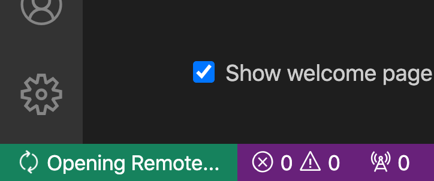
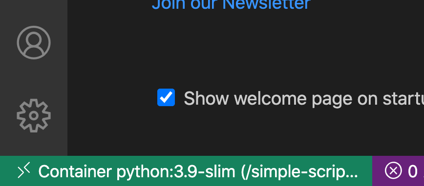
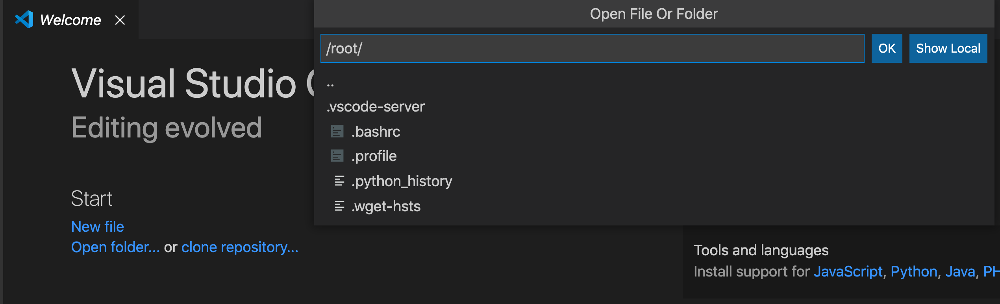
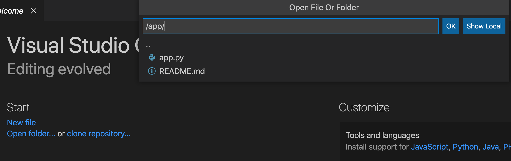
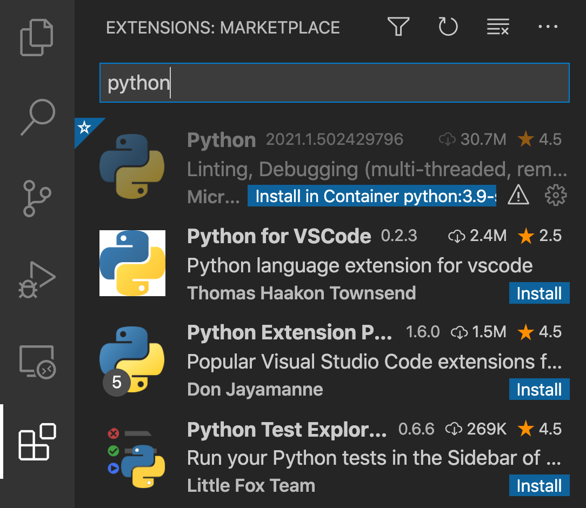
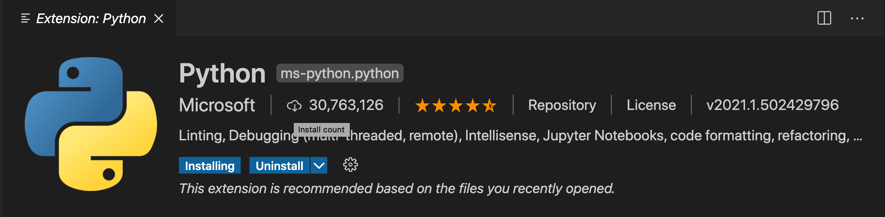
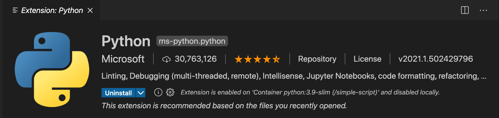

# Create a development container
Assuming you have cloned the repository, change to the tutorial directory with
```shell
cd flask-api
```

Start a new development container with:
```shell
docker run -i -t -d \
--name flask-api \
-v $(pwd):/app \
-w /app \
-p 8180:5000 \
python:3.9-slim \
bash
```

This will start a new container based on the [python 3.9 slim image](https://hub.docker.com/_/python) and mound the current (or present) working directory (`pwd`) to the `/app` directory.
This command will also start the `bash` process and interactively (`-i`) connect the local teletype (tty) terminal (`-t`) to the remote terminal in the container.
The container will also start in a detatched (`-d`) state, meaning that the container has started and is running in the background.
The port `-p` 5000 on the remote container will be exposed as 8180 on the host machine.

# Attach to running container.
In VS Code, click the `Remote Window` icon (bottom left green icon in VS Code).
Then from the dropdown, select `Remote Containers: Attach to running container...`.
In the list of available containers, choose `flask-api`.
This will open a new VS Code window.  The `Remote Window` icon in the bottom left will show `Opening Remote`.



After a short period of remote tool installation, this will change to the container name, e.g. `Container: python:3.9-slim (/flask-api)`.



Once connected, the VS Code welcome page will show an option to `Open folder...` under the `Start` section.  Once clicked a dropdown will be displayed showing the file system on the container.




Replace `/root` with `/app`, which is the directory in the container where the project source code is mounted.



Click `OK` to open the directory.  The sidebar should now show the contents of this tutorials, including this `README.md` file.


# Install Python extension
Inside the VS Code remote window, go to the extensions icon of the left-hand activity panel.
Search for the official Microsoft Python extension pack that includes linting and debugging tools and click the `Install in Container python:3.9-slim (/flask-api)`



Once installation begins, the `Install` buttons will change to `Installing`



Once installed, the buttons will change to uninstall.



# Install dependencies
In a terminal in the VS Code window in the container, run:
```shell
pip install flask
```

Ensure that the Python interpreter is showing as `3.9.1 64-bit` and not `Select Python Interpreter selected`.


If not selected, you may later on see the following error:


# Debug application
Open  the `app.py` script and set a breakpoint on one of the line 10.
A breakpoint is an instruction to the runtime to pause code execution when it reaches a specific line (files are processed from top to bottom).
To set the breakpoint, click slightly to the left of the line number in the margin.


Then, on the left-hand Activity panel, choose the debug icon (Play).  You will then have the option to `create a launch.json file`.  In the dropdown choose Flask and update the configuration with following.  Note specifically the `args` section, with the addition of the host `-h` argument and `0.0.0.0`.
Note also setting `FLASK_DEBUG` to `1` to enable hot reloading.

```json
{
  "version": "0.2.0",
  "configurations": [
    {
      "name": "Python: Flask",
      "type": "python",
      "request": "launch",
      "module": "flask",
      "env": {
        "FLASK_APP": "app.py",
        "FLASK_ENV": "development",
        "FLASK_DEBUG": "1"
      },
      "args": [
        "run",
        "-h",
        "0.0.0.0"
      ],
      "jinja": true
    }
  ]
}
```

Then click the green play icon in the top left of the Debug side bar.


In the browser visit http://127.0.0.1:8180.  You should be presented with the greeting of the `home` method.  Then visit http://127.0.0.1:8180/10/20.  The browser should hang while the breakpoint in VS Code is active.  Step through the code and monitor the change of value.

Experiment with additional routes and changing the code logic, noting that saving a file will cause the API server to (hot) reload without restarting the debugger.
