# Create a development container
Assuming you have cloned the repository, change to the tutorial directory with
```shell
cd simple-script
```

Start a new development container with:
```shell
docker run -i -t -d \
--name simple-script \
-v $(pwd):/app \
-w /app \
python:3.9-slim \
bash
```

This will start a new container based on the [python 3.9 slim image](https://hub.docker.com/_/python) and mound the current (or present) working directory (`pwd`) to the `/app` directory.
This command will also start the `bash` process and interactively (`-i`) connect the local teletype (tty) terminal (`-t`) to the remote terminal in the container.
The container will also start in a detatched (`-d`) state, meaning that the container has started and is running in the background.

# Attach to running container.
In VS Code, click the `Remote Window` icon (bottom left green icon in VS Code).
Then from the dropdown, select `Remote Containers: Attach to running container...`.
In the list of available containers, choose `simple-script`.
This will open a new VS Code window.  The `Remote Window` icon in the bottom left will show `Opening Remote`.

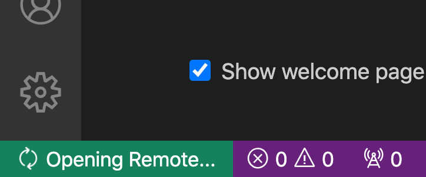

After a short period of remote tool installation, this will change to the container name, e.g. `Container: python:3.9-slim (/simple-script)`.

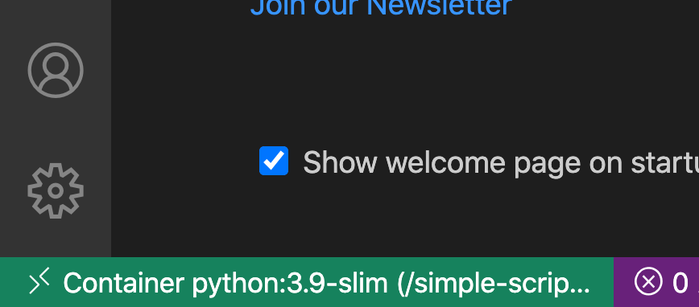

Once connected, the VS Code welcome page will show an option to `Open folder...` under the `Start` section.  Once clicked a dropdown will be displayed showing the file system on the container.


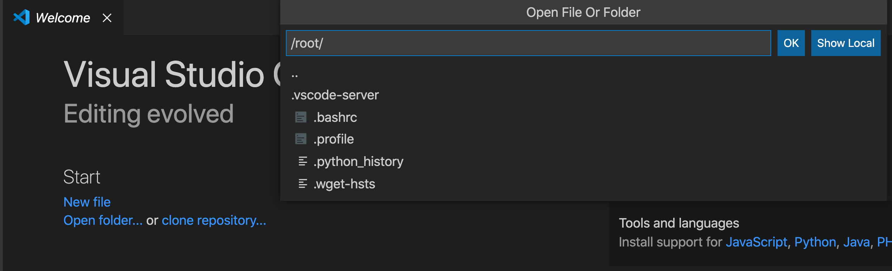

Replace `/root` with `/app`, which is the directory in the container where the project source code is mounted.

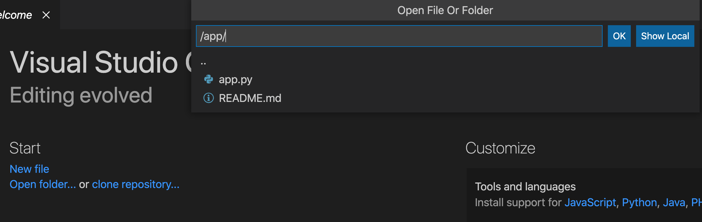

Click `OK` to open the directory.  The sidebar should now show the contents of this tutorials, including this `README.md` file.

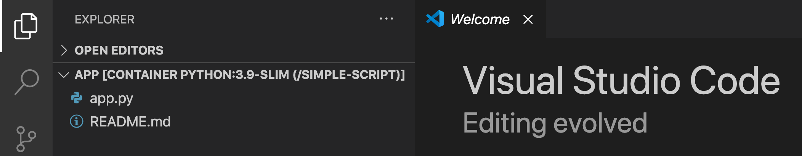

# Install Python extension
Inside the VS Code remote window, go to the extensions icon of the left-hand activity panel.
Search for the official Microsoft Python extension pack that includes linting and debugging tools and click the `Install in Container python:3.9-slim (/simple-script)`

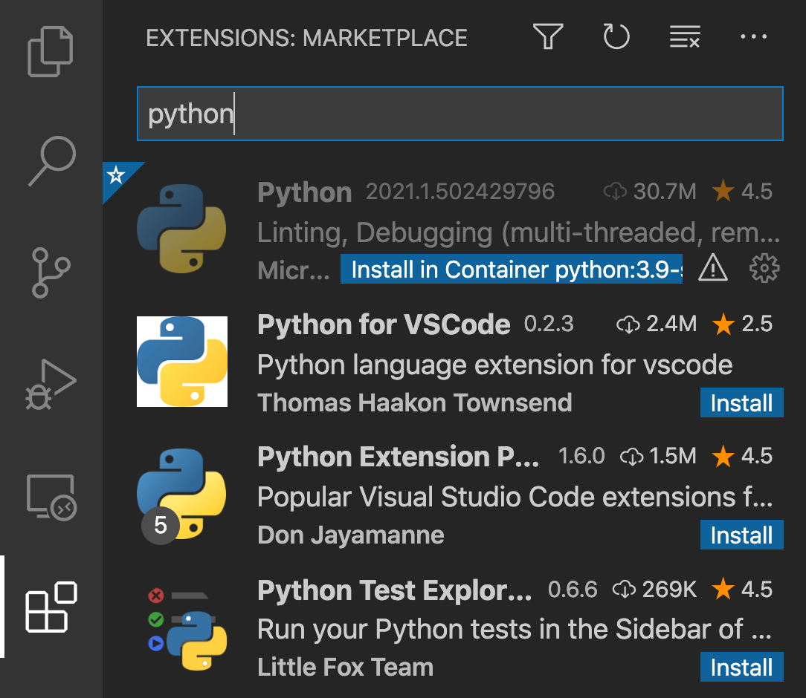

Once installation begins, the `Install` buttons will change to `Installing`


Once installed, the buttons will change to uninstall.

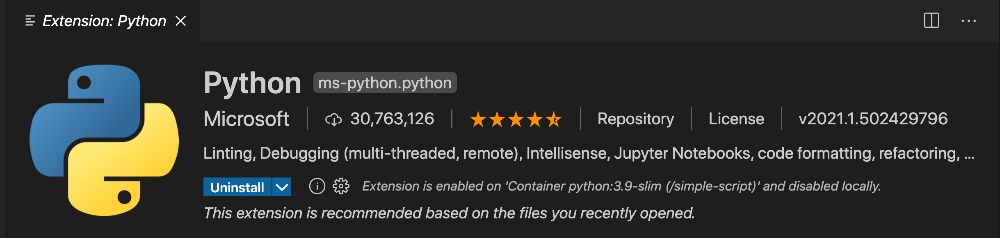

# Debug application
Open  the `app.py` script and set a breakpoint on one of the line 6.
A breakpoint is an instruction to the runtime to pause code execution when it reaches a specific line (files are processed from top to bottom).
To set the breakpoint, click slightly to the left of the line number in the margin.

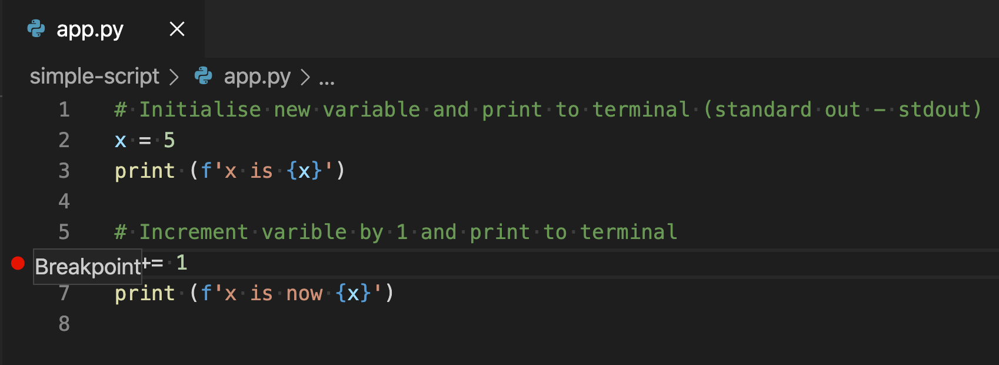

Then, on the left-hand Activity panel, choose the debug icon (Play).  You will then have the option to `Run and debug`.

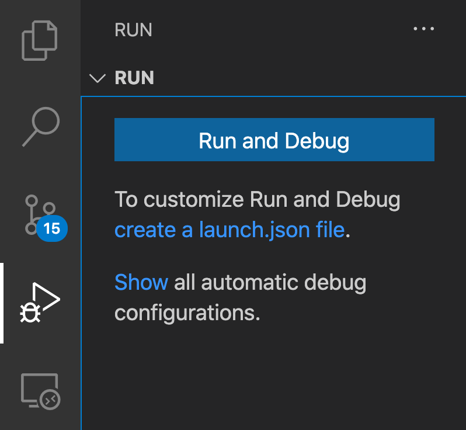

Click `Run and debug` which will open a new drop down, presenting a number of debug options.  Choose `Python File`.

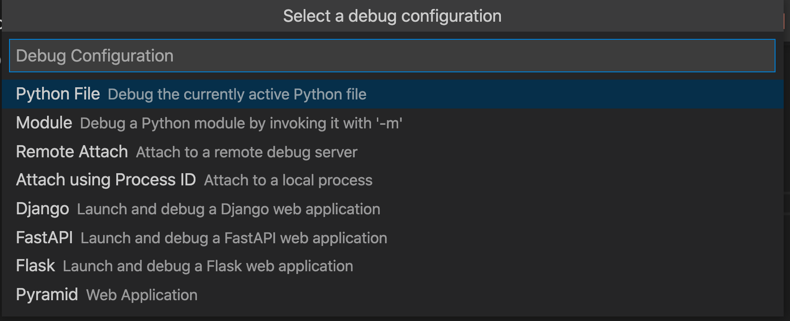

This will start the script and pause execution on the line with the breakpoint.
Notice on the left hand panel the current value of `x` is displayed.
Also notice a small menu bar appears on the top with a number of options.
These options control debugging operations.
Choose the arrow down with a dot icon (`Step Into (F5)`) to run the next line of code.

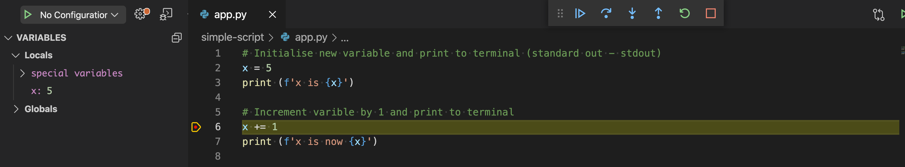

Once stepped into, note the value of `x` has changed in the left hand panel.

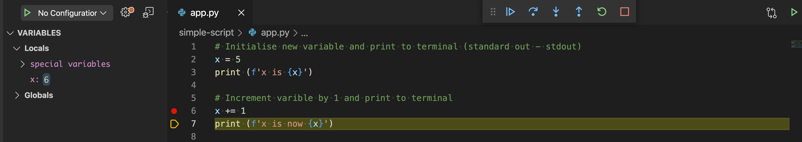

`Step into` may be clicked until the end of the program, or stepped over to jump over functions, or stopped completely.
